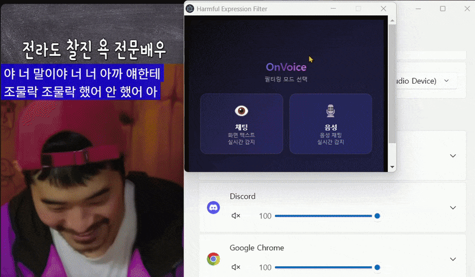
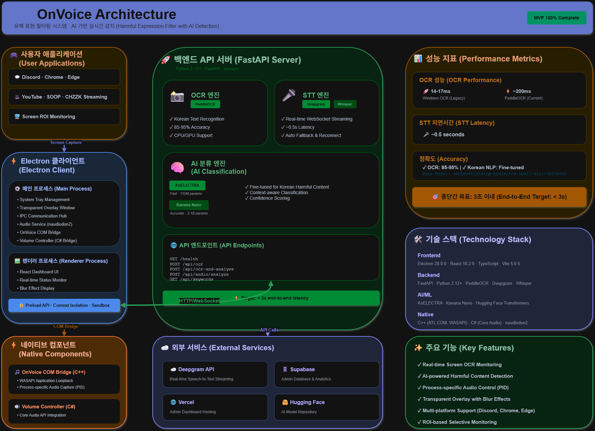

# OnVoice - 유해 표현 실시간 필터링 솔루션


**라이브 스트리밍을 더 안전하고 깨끗하게.**

OnVoice는 화면 속 텍스트와 음성 채팅을 실시간으로 분석하여 유해 표현을 자동으로 블러(Blur) 처리하고 볼륨을 조절하여 필터링하는 AI 기반 데스크톱 애플리케이션입니다.

---

## 팀원 소개 (Contributors)

이 프로젝트는 기획부터 개발까지 팀원 간의 긴밀한 협업으로 만들어졌습니다.

| 이름 (GitHub)                                                    | 역할 및 기여도                                                                                                                                                                |
| :--------------------------------------------------------------- | :---------------------------------------------------------------------------------------------------------------------------------------------------------------------------- |
| **김원**<br>[@cccwon2](https://github.com/cccwon2)               | **Main Development (App/Server)**<br>• Electron & FastAPI 아키텍처 설계 및 구현<br>• 오디오/OCR 파이프라인 및 코어 로직 개발<br>• C\#/C++ 네이티브 모듈 통합 및 시스템 최적화 |
| **신동석**<br>[@dsshin99999](https://github.com/dsshin99999)     | **Planning & QA**<br>• 서비스 기획 및 요구사항 정의<br>• 시나리오 기반 테스트 및 디버깅 협업<br>• 품질 보증 및 이슈 트래킹                                                    |
| **손찬우**<br>[@SonChanWoo123](https://github.com/SonChanWoo123) | **Planning & Dashboard**<br>• 서비스 기획 및 UX 설계<br>• Next.js 기반 유저/관리자 대시보드 구축<br>• 데이터 시각화 및 웹 프론트엔드 개발                                     |

---

## 프로젝트 소개

라이브 방송 중 화면에 노출되는 욕설이나 음성으로 들리는 비속어 때문에 곤란했던 적이 있으신가요? OnVoice는 방송 송출자가 안심하고 방송할 수 있도록 돕는 보조 도구입니다.

### 핵심 기능

1.  **화면 유해 텍스트 블라인드 (OCR)**: 화면의 특정 영역(ROI)을 감시하다가 유해 텍스트가 감지되면 0.1초 내에 자동으로 블러 처리합니다. (PaddleOCR + KoElectra 사용)

2.  **음성 유해어 볼륨 제어 (STT)**: 실시간으로 오디오를 분석하여 욕설이 나올 때 해당 애플리케이션의 **볼륨을 순간적으로 낮춰** 불쾌감을 줄입니다. 특정 프로세스(PID)의 오디오만 격리하여 캡처하는 C++ Application Loopback과 C\# Core Audio API를 통해 정확한 앱별 제어가 가능합니다. (Deepgram + C++ WASAPI + C\# NAudio.Wasapi)

   

3.  **지능형 AI 분석**: 단순 금칙어가 아닌, 문맥을 파악하는 AI 모델(KoElectra/Kanana)을 사용하여 높은 정확도로 유해성을 판별합니다.

4.  **시스템 리소스 최적화**: 방송 중 프레임 저하를 막기 위해 C++/C\# 네이티브 모듈과 GPU 가속을 적극 활용했습니다.

---

## 기술 스택 (Tech Stack)

저희는 최고의 성능과 안정성을 위해 다양한 기술을 하이브리드로 구성했습니다.

### Frontend (Desktop App)

- **Electron (React + TypeScript)**: 사용자 인터페이스 및 오버레이 윈도우 관리

- **Next.js**: 관리자 및 사용자 대시보드 (Vercel 배포)

### Backend (AI Server)

- **FastAPI (Python 3.12)**: 텍스트 분석 및 OCR 처리 서버

- **PaddleOCR**: 고성능 한국어 OCR 엔진 (GPU 가속 지원)

- **Deepgram**: 초저지연 실시간 STT (Speech-to-Text)

- **KoElectra / Kanana**: 한국어 특화 유해 표현 분류 모델

### Native Integration (Performance)

- **C\# Bridge (Spawn 방식)**:

  - **NAudio.Wasapi**: Windows Core Audio API를 직접 사용한 PID 기반 앱별 볼륨 제어
  - 오디오 세션 관리 및 실시간 볼륨 조절 (0.0 ~ 1.0 스케일)
  - 독립 프로세스 구조로 안정성 강화

- **C++ Core Audio (COM Bridge)**:

  - **WASAPI Application Loopback**: 특정 프로세스(PID)의 오디오만 격리하여 캡처
  - `PROCESS_LOOPBACK_MODE`를 활용한 고성능 오디오 캡처
  - Windows 10 SDK 10.0.20348.0 이상 필요

- **Supabase**: 로그 저장 및 설정 관리 데이터베이스

---

## 시스템 아키텍처

사용자(User)는 Electron 앱을 통해 서비스를 이용하며, 로컬 PC 내에서 화면 블라인드, 볼륨 제어, 오디오 캡처가 이루어집니다.

**오디오 처리 파이프라인**:

- **C++ WASAPI Application Loopback**: 타겟 애플리케이션(Chrome/Edge/Discord 등)의 오디오 세션을 PID로 필터링하여 격리 캡처
- **C\# COM Bridge**: 캡처된 PCM 데이터를 Electron으로 전달하고, 볼륨 제어 명령을 Windows Core Audio API로 실행
- **Deepgram STT**: 실시간 오디오 스트림을 텍스트로 변환

**AI 분석 서버**:

- **FastAPI 서버**: 이미지와 오디오 데이터를 받아 OCR, STT, NLP 분석을 수행하고 결과를 반환
- **PaddleOCR**: 화면 텍스트 인식 (85-95% 정확도)
- **KoElectra/Kanana**: 문맥 기반 유해 표현 분류

관리자는 웹 대시보드를 통해 로그를 확인하고 설정을 관리할 수 있습니다.



---

## 개발 여정 (Development Journey)

저희는 총 51개의 세분화된 Task를 통해 이 프로젝트를 완성했습니다. 주요 개발 마일스톤은 다음과 같습니다.

- **Phase 1: 기반 구축 (Task 01\~18)**

  - Electron 오버레이 윈도우와 시스템 트레이 구현

  - 화면 캡처 및 기본적인 OCR 모니터링 로직 완성

- **Phase 2: 서버 및 AI 연동 (Task 20\~28)**

  - FastAPI 서버 구축 및 텍스트 분석 API 개발

  - Deepgram을 이용한 실시간 음성 인식 연동

  - PaddleOCR 도입으로 인식률 대폭 개선

- **Phase 3: 성능 최적화 및 안정화 (Task 29\~40)**

  - **C\# Bridge 마이그레이션**: 기존 라이브러리의 불안정성을 해결하기 위해 Spawn 방식의 독립 프로세스 구조로 전환

  - **C++ Application Loopback 구현**: WASAPI의 `PROCESS_LOOPBACK_MODE`를 활용하여 특정 PID의 오디오만 격리 캡처하는 기능 구현 (Task 40)

  - **C\# 볼륨 제어 통합**: `native-sound-mixer` 의존성을 제거하고 NAudio.Wasapi를 사용한 Windows Core Audio API 기반 PID 볼륨 제어로 완전 전환 (Task 39)

  - **적응형 인터벌**: 화면 변화에 따라 OCR 주기를 자동 조절하여 CPU 점유율 최적화

  - **블라인드 처리 고도화**: 오버레이가 OCR 캡처를 방해하지 않도록 윈도우 속성 최적화

- **Phase 4: 대시보드 및 배포 (Task 41\~51)**

  - Next.js 기반의 관리자 대시보드 통합

  - UUID 기반 사용자 식별 및 로깅 시스템 구축

  - Windows 인스톨러 및 포터블 버전 배포 자동화

> 상세한 개발 문서와 트러블슈팅 기록은 docs 폴더에서 확인하실 수 있습니다.

---

## 시작하기 (Getting Started)

### 사전 요구사항

- Node.js 18+

- Python 3.12+

- Windows 10 Build 19041 이상 (Application Loopback API 지원)

- Windows 10 SDK 10.0.20348.0 이상 (C++ 빌드 시)

- CUDA 13+ (GPU 가속 사용 시 권장)

### 설치 및 실행

1.  **저장소 클론**

    ```bash
    git clone https://github.com/cccwon2/harmful-expression-filter.git
    cd harmful-expression-filter
    ```

2.  **Backend (Server) 실행**

    ```bash
    cd server
    python -m venv venv312
    source venv312/bin/activate  # Windows: venv312\Scripts\activate
    pip install -r requirements.txt
    uvicorn main:app --reload
    ```

3.  **Frontend (Electron) 실행**

    ```bash
    # 새 터미널에서
    npm install
    npm run dev
    ```

4.  **환경 변수 설정**: 루트 디렉토리와 server 디렉토리에 .env 파일을 생성하고 필요한 키(Deepgram API Key 등)를 입력해야 합니다.

> 자세한 설치 및 설정 가이드는 [docs/README-original.md](./docs/README-original.md)를 참조하세요.

---

## 라이선스

[MIT License](LICENSE). 누구나 자유롭게 사용하고 기여할 수 있습니다.
